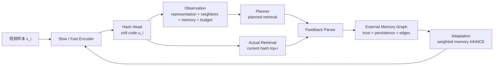

# Agentic Retrieval 闭环核心概念与实现机制

本文用于组会讲解 `doc/agentic_retrival.md` 中的 agentic retrieval 方案。重点不是把方法讲成一个“调用大模型的系统”，而是讲清楚：

```text
视频哈希训练不再只依赖固定正负样本表，而是形成一个可观测、可反馈、可记忆、可自适应的检索闭环。
```

当前 RF-CLaTH 的核心实现是 conservative 的：前向网络和主干哈希训练保持稳定，agentic feedback 主要通过 `L_memory_selfcal` 进入训练；`L_semantic` 和 `L_hash` 保持干净，避免早期噪声污染整个优化目标。

## 1. 总体闭环

可以把方法讲成五个连续环节：

| 环节 | 一句话定义 | 在视频哈希中的作用 |
|---|---|---|
| Observation | 模型在行动前看到的状态 | 当前样本表示、邻居统计、memory 状态和训练预算 |
| Action | 模型或外层 agent 对训练过程做出的动作 | 产生 hash code，并可决定样本权重、分支路由和检索预算 |
| Feedback | 检索动作返回的外部证据 | 比较 planned retrieval 和 actual retrieval，识别漏检与误检 |
| Memory | 对历史检索状态的持久化记忆 | 记录可靠边、失败边、历史检索状态和边置信度 |
| Adaptation | 下一轮训练如何被反馈改变 | 动态调整正负关系和权重，而不是固定邻居表一跑到底 |

整体流程可以画成：



这张图的讲解重点是：`hash code` 不是训练的终点，而是检索环境中的一次行动；检索结果反过来修正下一步训练。

## 2. Observation：模型到底“看见”了什么

Observation 不是一段文本提示词，而是一个结构化训练状态。对样本 `i`，它包含四类信息。

### 2.1 当前样本表示

模型首先看到当前样本经过两条分支后的表示：

```text
h_s_i: slow branch 的语义表示
h_f_i: fast branch 的时序表示
u_i:   fusion 后的 soft hash code
z_i:   memory bank 中保存的历史 hash 表示
```

RF-CLaTH 当前主干可以按下面理解：

```text
T-SAS / PER-SAS:
  选择更有语义代表性的关键帧。

SelectedClassAttention slow branch:
  强调内容语义和类别相关线索。

BidirectionalMamba fast branch:
  建模全部帧或剩余帧的时序动态。

Content-Time Lateral Fusion:
  把内容和时序信息横向融合，生成最终 hash 表示。
```

这些表示构成 observation 的第一部分：模型知道当前视频“长什么样”，以及它在 hash 空间里暂时落在哪里。

### 2.2 邻居统计

模型还需要知道当前样本周围有哪些候选邻居：

```text
raw neighbors:
  由离线 raw feature kNN 得到的静态邻居，作为相对可信的初始锚点。

batch neighbors:
  当前 mini-batch 内的邻居关系，用于稳定 batch-level semantic structure。

planned neighbors:
  planner 根据 semantic / temporal / hash memory 认为应该检索到的样本。

actual neighbors:
  当前 hash code 实际从 memory bank 中检索到的样本。
```

这里的关键是区分 `raw neighbors` 和 `actual neighbors`：

```text
raw neighbors:
  来自原始视频特征，变化慢，适合作为训练早期的可信锚点。

actual neighbors:
  来自当前 hash 空间，能反映模型当下的真实检索行为，但早期可能很噪。
```

所以 observation 不是盲目信任当前检索结果，而是同时观察“静态邻居先验”和“当前哈希检索现实”。

### 2.3 Memory 状态

Memory 提供跨 batch、跨 epoch 的历史信息：

```text
valid_i:
  样本 i 在 memory bank 中是否已经有可用表示。

trust_i:
  当前样本的检索反馈可信度。

persistence_ij:
  边 (i, j) 的持续性，表示这条边是不是连续多次出现。

edge type:
  raw / planned / missed / false 等边类型。

age_ij:
  边或节点距离上次更新过去了多久。
```

这让训练不再只看当前 batch，而是拥有一个外部邻居图作为“训练世界模型”。

### 2.4 训练预算

Observation 还包括训练进度：

```text
epoch / step:
  当前训练到哪个阶段。

warmup / cut:
  actual retrieval trace 是否已经可信到可以启用。

remaining budget:
  剩余训练轮数、评估窗口、刷新窗口。

recent metrics:
  最近的 mAP、AUCL 统计、trust、bit saturation 等诊断量。
```

这一部分决定 agentic feedback 何时开始生效。当前实现不是从第 1 个 epoch 就相信 actual retrieval，而是先 warm up，等 hash 空间有基本结构后再开启 trace。

## 3. Action：模型和 agent 能做哪些动作

Action 可以分成当前已经落地的动作和后续可扩展动作。

### 3.1 当前核心动作：产生 hash code

最基础、也是已经完全实现的 action 是：

```text
u_i = model(x_i)
b_i = sign(u_i)
```

其中：

```text
u_i:
  连续 soft hash code，用于训练阶段计算相似度和梯度。

b_i:
  二值 hash code，用于最终检索评估。
```

从 agentic 视角看，`u_i` 不是普通 embedding，而是模型在检索环境中的行动结果。它决定：

```text
1. actual retrieval 会返回哪些样本；
2. 哪些 planned neighbors 被成功命中；
3. 哪些样本成为 missed positives；
4. 哪些样本成为 false positives / hard negatives。
```

### 3.2 样本权重动作

第二类动作是给不同样本或不同边分配训练权重：

```text
omega_i:
  样本 i 的整体训练权重。

a_ij:
  正边 (i, j) 的正样本权重。

d_ij:
  负边 (i, j) 在分母中的权重。
```

在当前 self-calibrated memory loss 中，这个动作主要落在边权重上：

```text
raw edge:
  默认可信，作为稳定正边。

planned edge:
  planner 认为应该近，但需要 trust 和 persistence 门控。

missed edge:
  应该检索到却没检索到，是更强的 hard positive。

false edge:
  当前 hash 误检到的样本，是 hard negative。
```

所以目前不是训练一个复杂 policy network 去直接输出 `omega_i`，而是用可解释的 `trust_i` 和 `persistence_ij` 把权重自动校准出来。

### 3.3 分支路由动作

设计文档中还有 fusion / routing action：

```text
alpha_i in [0, 1]

alpha_i 越大:
  当前样本更依赖 semantic / slow branch。

alpha_i 越小:
  当前样本更依赖 temporal / fast branch。
```

它的理想作用是：

```text
内容语义可靠的样本:
  更多通过 slow branch 拉近。

时序动态关键的样本:
  更多通过 fast branch 拉近。

某个分支导致 false retrieval:
  hard negative 梯度更多作用到对应子码。
```

这一部分是 agentic retrieval 的自然扩展方向。当前最稳妥版本主要先把 feedback 收敛进 `L_memory_selfcal`，没有把不稳定 feedback 同时注入所有分支路由。

### 3.4 检索预算动作

检索预算动作控制每个样本查多少邻居：

```text
top_r:
  actual retrieval 时从 memory bank 取前 r 个。

top_m:
  planned / missed 参与训练的前 m 个。

refresh interval:
  memory graph 多久刷新一次。
```

预算动作的意义是：不是所有样本都需要同样昂贵的检索。困难样本、低 trust 样本、反复 missed 的样本，可以分配更高检索预算；稳定样本可以降低预算。

当前实现中预算大多是固定超参，例如 actual trace 使用固定 `top_r`，planned / missed 使用固定 top-k。这样更稳定，也更容易做消融。

## 4. Feedback：planned 和 actual 如何产生训练信号

Feedback 是整个方案最关键的创新点。它回答一个问题：

```text
模型“计划应该检索到什么”和“当前 hash 实际检索到什么”之间差在哪里？
```

### 4.1 四个集合

对每个 anchor `i`，定义四个集合：

```text
P_i = planned(i)
A_i = actual(i)
M_i = P_i - A_i
F_i = A_i - P_i
```

对应含义：

| 集合 | 含义 | 训练解释 |
|---|---|---|
| `P_i` planned | planner 认为应该检索到的邻居 | 计划正样本 |
| `A_i` actual | 当前 hash code 实际检索到的邻居 | 真实检索行为 |
| `M_i` missed | 应该检索到但没检索到 | hard positive |
| `F_i` false | 实际检索到但不应靠近 | hard negative |

讲解时可以用一个简单例子：

```text
planned(i) = {2, 7, 9, 12}
actual(i)  = {2, 5, 7, 20}

命中:   {2, 7}
missed: {9, 12}
false:  {5, 20}
```

这说明当前 hash code 已经学到了一部分正确邻居，但还漏掉了 `9, 12`，同时错误拉近了 `5, 20`。

### 4.2 planned retrieval 从哪里来

Planned retrieval 不是标签监督，而是由 memory planner 估计的“应检索邻居”。它可以融合三类证据：

```text
P_s:
  semantic similarity，偏内容语义。

P_t:
  temporal similarity，偏动态模式。

P_z:
  hash memory similarity，偏当前哈希空间。
```

融合形式可以理解为：

```text
score_plan(i, j)
  = omega_s * P_s(i, j)
  + omega_t * P_t(i, j)
  + omega_z * P_z(i, j)
```

训练早期 hash 空间还不稳定，因此可以降低 `omega_z`：

```text
warmup:
  更依赖 semantic / temporal evidence。

after trace starts:
  逐步让 hash memory evidence 参与 planned retrieval。
```

当前脚本中的常用设定就是这种思想：warmup 阶段不依赖 hash trace，trace 开启后再让 hash memory 证据参与。

### 4.3 actual retrieval 从哪里来

Actual retrieval 来自当前模型产生的 hash 表示：

```text
q_i = normalize(0.5 * (u_i^view1 + u_i^view2))
A_i = top_r retrieval from memory bank using q_i
```

它回答的是：

```text
如果现在就用这个模型做检索，它会把哪些样本排在前面？
```

这一步非常重要，因为传统训练通常只优化一个静态损失，而不显式比较“训练目标”和“真实检索行为”的偏差。Agentic retrieval 把这个偏差提取出来，变成可学习的反馈。

### 4.4 missed 和 false 如何进入损失

Missed positives：

```text
M_i = P_i - A_i
```

含义是 planner 认为应该相似，但当前 hash 没有检索到。训练上要把它们拉近：

```text
missed edge:
  作为 hard positive 进入 L_memory_selfcal 的正样本集合。
```

False positives：

```text
F_i = A_i - P_i
```

含义是当前 hash 拉近了不该近的样本。训练上要把它们推远：

```text
false edge:
  作为 hard negative 加大分母权重。
```

这就是 feedback 的核心：不是简单说“检索错了”，而是把错误分成两种可优化方向：

```text
漏检:
  该近不近，补正样本。

误检:
  不该近却近，强化负样本。
```

## 5. Memory：为什么需要外部邻居图

Memory 不是普通 feature cache，而是一个外部邻居图。它解决三个问题：

```text
1. 跨 batch 保存全局邻居关系；
2. 记录一条边的历史可靠性，而不是只看当前 step；
3. 让 feedback 可以持续影响后续训练。
```

### 5.1 Memory bank

Memory bank 保存每个训练样本的历史表示：

```text
M_i:
  样本 i 的 EMA soft hash 表示。

valid_i:
  M_i 是否已经被有效写入。

update:
  用当前 batch 的 q_i 对 M_i 做 EMA 更新。
```

这样，mini-batch 外的样本也能成为检索候选。否则只能在 batch 内做对比学习，无法模拟真实视频检索。

### 5.2 Edge memory

除了节点表示，还需要保存边状态：

| 字段 | 作用 |
|---|---|
| `edge_type` | 区分 raw / planned / missed / false |
| `weight` | 当前训练使用的边强度 |
| `trust` | anchor 级反馈可信度 |
| `persistence` | 这条边是否连续出现 |
| `last_update` | 最近更新时间 |
| `age` | 防止旧边长期不衰减 |

其中最关键的是 `trust` 和 `persistence`。

### 5.3 Trust：当前反馈可信吗

当前实现使用 raw neighbors 来估计 actual retrieval 是否可信：

```text
g_i = |Actual(i) ∩ RawTopK(i)| / |RawTopK(i)|
```

再用 EMA 平滑：

```text
trust_i <- mu * trust_i + (1 - mu) * g_i
```

直觉是：

```text
如果当前 hash 检索结果连 raw kNN 中的稳定邻居都很少命中，
说明 actual retrieval 还不可靠；
这时 planned / missed / false 不应该强行进入训练。
```

Trust 的作用是给 feedback 加安全阀：

```text
trust_i 高:
  更相信 planned / missed / false。

trust_i 低:
  feedback 权重接近 0，退回 raw-only memory training。
```

### 5.4 Persistence：单步错误不一定可信

Missed 或 false 在单个 step 出现，可能只是噪声。因此需要边持续性：

```text
persistence_ij <- mu * persistence_ij
                  + (1 - mu) * 1[j appears in feedback(i)]
```

直觉是：

```text
连续 missed:
  更可能是真正学不好的 hard positive。

偶然 missed:
  可能只是 batch augmentation 或 memory 滞后造成的噪声。

连续 false:
  更可能是 hash 空间系统性混淆。
```

所以 edge memory 不会因为一次反馈就剧烈改变训练目标，而是要求反馈具有持续性。

## 6. Adaptation：反馈怎样改变下一轮训练

Adaptation 的核心是把 feedback 转成 `L_memory_selfcal` 中的正负边权重。

### 6.1 三类损失的职责边界

讲解时建议把当前目标拆成三类职责：

```text
L_total = L_semantic + L_memory_selfcal + L_hash
```

其中：

```text
L_semantic:
  负责 batch 内两视图和 raw neighbor 的语义结构。
  不吃 actual retrieval feedback。

L_memory_selfcal:
  负责全局 memory 空间。
  唯一吃 planned / actual / missed / false / trust / persistence。

L_hash:
  负责二值化质量，包括 quantization 和 bit balance。
  不吃 retrieval feedback。
```

这个边界非常重要。它说明当前方法不是把 feedback 到处注入，而是让不稳定的 agentic 信号只进入最适合它的 memory channel。

### 6.2 Memory InfoNCE 如何被自校准

普通 memory contrastive loss 可以写成：

```text
L_memory(i)
  = logsumexp(all valid memory similarities)
    - logsumexp(positive memory similarities)
```

Agentic self-calibration 做的事情是改变正负样本权重：

```text
positive weights:
  raw edge:
    a_ij = alpha_raw

  planned edge:
    a_ij = alpha_plan * trust_i * persistence_ij

  missed edge:
    a_ij = alpha_miss * trust_i * persistence_ij

negative weights:
  false edge:
    d_ij = 1 + (gamma_false - 1) * trust_i * persistence_ij
```

代入后：

```text
L_memory_selfcal(i)
  = logsumexp_j [log d_ij + sim(q_i, M_j)]
    - logsumexp_j [log a_ij + sim(q_i, M_j)]
```

这说明损失本身仍然是对比学习形式，但正负关系不再是固定表，而是由 retrieval feedback 动态校准。

### 6.3 为什么说“以对比损失为核心”但创新不止是对比损失

可以这样回答导师可能的问题：

```text
是的，底层可微优化仍然以 contrastive / InfoNCE 为核心。
但创新点不是又换了一个对比损失公式，而是把检索行为闭环化：

1. 先规划应该检索到的邻居；
2. 再观察当前 hash 实际检索到的邻居；
3. 用 missed / false 分解错误；
4. 用 memory graph 累积 trust 和 persistence；
5. 最后只在可信时把反馈注入 memory contrastive objective。
```

因此，对比损失只是 agentic feedback 进入神经网络训练的可微接口。真正的新意在于训练关系的动态生成、检索反馈的自校准，以及外部 memory graph 的持续适应。

### 6.4 优雅退化机制

当前方案最重要的安全性是：

```text
当 trust_i -> 0:
  planned / missed 的正边权重 -> 0；
  false 的 hard negative 加权 -> 1；
  L_memory_selfcal 退回 raw-only memory contrastive learning。
```

也就是说，如果 actual retrieval 不可信，agentic feedback 不会强行污染训练。训练至少退回到稳定的 raw-neighbor memory baseline。

## 7. 当前实现与设计扩展的边界

| 模块 | 当前状态 | 说明 |
|---|---|---|
| Hash action | 已实现 | 模型产生 soft code / binary code，actual retrieval 基于 soft code |
| Planned retrieval | 已实现 | planner 融合 semantic / temporal / hash memory 证据 |
| Actual retrieval trace | 已实现 | warmup 后从 memory bank 检索 top-r |
| Missed / false feedback | 已实现 | 用 planned 和 actual 的差集构造 |
| Trust gate | 已实现 | 用 actual 命中 raw top-k 的比例估计可信度 |
| Edge persistence | 已实现 | 防止单步 feedback 直接主导训练 |
| Memory self-calibrated loss | 已实现 | feedback 只进入 memory channel |
| Sample-wise fusion route | 设计扩展 | 可进一步控制 slow / fast 子码贡献 |
| Dynamic retrieval budget | 设计扩展 | 可按样本难度调整 top-r / refresh 频率 |
| Stop policy | 设计扩展 | 可根据 mAP slope / trust / saturation 判断训练停止 |

组会讲解时建议明确说：当前实验版先验证最关键、最稳的闭环，即 `planned-actual feedback -> trust/persistence -> memory contrastive adaptation`。更复杂的 routing / budget / stop 是在这个闭环稳定后的自然扩展。

## 8. 一轮训练的机制伪代码

```text
for each mini-batch B:
    # 1. Forward as action
    u_a, u_b = model(two_views(B))
    q = normalize(0.5 * (u_a + u_b))

    # 2. Observation
    raw_neighbors = raw_knn_cache[B]
    memory_state = memory_bank.read()
    training_state = epoch / cut / budget / diagnostics

    # 3. Planned retrieval
    planned = graph_planner.plan(
        semantic_score,
        temporal_score,
        hash_memory_score
    )

    # 4. Actual retrieval
    if epoch >= trace_start:
        actual = memory_bank.retrieve(q, top_r)
    else:
        actual = empty

    # 5. Feedback
    missed = planned - actual
    false = actual - planned

    # 6. Trust and persistence
    trust = ema_hit_ratio(actual, raw_neighbors)
    persistence = ema_edge_occurrence(planned, missed, false)

    # 7. Adaptation through loss
    L_semantic = clean_batch_semantic_loss(u_a, u_b, raw_neighbors)
    L_memory = selfcal_memory_infonce(
        q, memory_bank,
        raw_neighbors, planned, missed, false,
        trust, persistence
    )
    L_hash = quantization_and_balance(u_a, u_b)

    L_total = L_semantic + L_memory + L_hash
    backprop(L_total)

    # 8. Memory update
    memory_bank.ema_update(sample_indices=B, values=q)
    memory_graph.update_edges(planned, missed, false, trust, persistence)
```

这段伪代码可以作为讲解主线：每一轮不是“采样、前向、算损失”就结束，而是多了检索环境反馈和外部记忆更新。

## 9. 组会讲解口径

### 9.1 一句话版本

```text
RF-CLaTH 的 agentic retrieval 不是把 LLM 放进训练，而是把视频哈希训练改造成一个检索闭环：模型先产生 hash 行动，再比较计划检索与实际检索，用 missed / false 反馈更新外部 memory graph，并只在可信时自适应地改变 memory contrastive learning。
```

### 9.2 面向导师的三层解释

第一层：传统视频哈希的问题。

```text
传统方法通常固定正负样本或固定邻居表。
这会导致训练目标和真实检索行为脱节：
模型到底漏检了谁、误检了谁，并没有被显式建模。
```

第二层：agentic retrieval 的核心变化。

```text
我们把 hash code 看成一次检索行动。
每轮训练都比较 planned retrieval 和 actual retrieval。
差异被拆成 missed positives 和 false positives。
这些反馈不是直接相信，而是经过 trust 和 persistence 写入 memory graph。
```

第三层：为什么机制可控。

```text
反馈只进入 L_memory_selfcal。
如果当前 retrieval trace 不可信，trust 会把 feedback 权重压低，
损失退回 raw-only memory contrastive learning。
因此方案既有闭环创新，也有稳定退化边界。
```

### 9.3 被问“损失是不是以对比损失为核心”时

可以答：

```text
是。底层训练仍然使用 contrastive / InfoNCE，因为视频哈希需要学习相似样本近、不相似样本远的可微几何。

但本文创新不是普通对比损失，而是对比损失的正负关系不再固定：
planned / actual / missed / false 由检索闭环产生；
trust / persistence 决定这些反馈是否可信；
memory graph 让反馈跨 batch 保留并影响下一轮训练。
```

## 10. 术语速查

| 术语 | 解释 |
|---|---|
| `soft hash code` | 训练阶段的连续哈希向量，通常经过 `tanh` 或归一化 |
| `binary hash code` | 检索阶段的二值码，通常由 `sign(u)` 得到 |
| `raw neighbor` | 由原始视频特征离线计算的 kNN 邻居 |
| `memory bank` | 保存全训练集历史 hash 表示的外部缓存 |
| `memory graph` | 在 memory bank 之上记录边类型、边权重、trust、persistence 的邻居图 |
| `planned retrieval` | planner 认为当前样本应该检索到的邻居 |
| `actual retrieval` | 当前 hash 表示从 memory bank 实际检索到的邻居 |
| `missed positive` | planned 中有、actual 中没有的样本，表示漏检 |
| `false positive` | actual 中有、planned 中没有的样本，表示误检 |
| `trust` | 当前 anchor 的 feedback 可信度 |
| `persistence` | 某条 feedback 边是否持续出现 |
| `L_memory_selfcal` | 唯一接收 agentic feedback 的 self-calibrated memory contrastive loss |
| `graceful degradation` | feedback 不可信时退回 raw-only memory loss 的安全机制 |

## 11. 和当前代码/配置的对应关系

讲思路时不需要展开代码，但可以准备下面的对应关系以便答疑：

| 机制 | 主要位置 | 说明 |
|---|---|---|
| objective 选择 | `engine/train.py` | 把 `merged_semantic_self_calibrated` 映射到对应 loss |
| self-calibrated memory loss | `losses/arf_loss.py` | 组织 `L_semantic`、memory self-calibration 和 hash 正则 |
| planned / actual / missed / false | `losses/contrastive.py` | 构造 retrieval feedback observation |
| trust / persistence | `losses/contrastive.py` | 计算 feedback 可信度和边持续性 |
| 当前推荐运行脚本 | `tools/run_rf_clath_merged_selfcal_best_disk2.sh` | 固定当前实验的 cut、top-k、planner 权重等设置 |
| 损失边界说明 | `doc/loss_plan.md` | 解释为什么 feedback 只进入 memory channel |
| 方案设计原文 | `doc/agentic_retrival.md` | 完整 agentic retrieval 设计 |
| self-calibration 细节 | `doc/agentic_memory.md` | memory feedback、trust、persistence 的详细设计 |

如果导师追问“这是不是还停留在概念”，可以回答：

```text
不是纯概念。
当前已经把 planned / actual / missed / false、
trust gate、edge persistence 和 self-calibrated memory InfoNCE
落到了 loss 与 contrastive 代码中。

但 sample-wise fusion route、动态预算和 stop policy
仍属于后续扩展，不作为当前最稳实验版的必要前提。
```

## 12. 可以配的图

组会 PPT 中建议放三张图。

第一张：闭环总图。

```text
Video -> Encoder -> Hash Action -> Actual Retrieval
                    ^                 |
                    |                 v
              Adaptation <- Memory <- Feedback
```

第二张：planned / actual 差集图。

```text
planned: {2, 7, 9, 12}
actual:  {2, 5, 7, 20}

hit:     {2, 7}
missed:  {9, 12}
false:   {5, 20}
```

第三张：损失注入边界图。

```text
L_semantic  <--- batch view / raw neighbor, no feedback
L_memory    <--- planned / actual / missed / false / trust / persistence
L_hash      <--- quantization / balance, no feedback
```

这三张图分别回答：

```text
1. 为什么叫 agentic retrieval；
2. feedback 到底怎么定义；
3. 为什么 feedback 不会污染整个训练。
```
