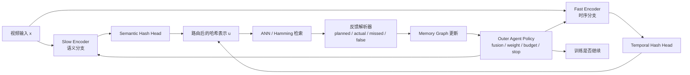
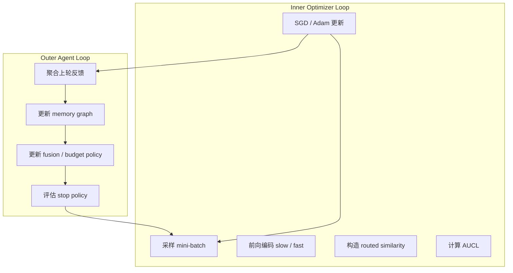

# Agentic Retrieval 训练框架设计

本文整理一个可落地的 **Agentic Video Hashing Training Framework**：
把视频哈希训练从固定损失驱动的表示学习，扩展为带外部记忆、检索反馈、
动态路由和自主终止策略的双层闭环系统。

这不是用 agent 替代 SGD。更稳妥的划分是：

```text
inner optimizer:
  负责 encoder / hash head 的连续参数更新。

outer agent:
  负责样本级融合路由、邻居图记忆更新、检索反馈解释、
  训练资源分配和停止决策。
```

## 1. 执行摘要

视频哈希的核心目标是在检索精度、二值码压缩率和大规模检索效率之间取得平衡。
传统训练通常依赖固定损失：

```text
video -> encoder -> hash code -> loss -> SGD
```

Agentic retrieval 的目标是把检索过程本身也纳入训练闭环：

```text
observe -> route -> retrieve -> feedback -> memory update -> adapt
```

本文建议采用 **minimal-loss** 方案：

```text
L_total =
  L_AUCL
+ lambda_q * L_quant
+ lambda_b * L_balance
+ lambda_route * L_route   # optional
```

其中 `L_AUCL` 是唯一的语义/检索反馈主目标。paired-view、raw neighbor、
memory neighbor、planned、missed 和 false retrieval 不再拆成多个独立损失，
而是进入同一个 source-aware multi-positive objective。

### 1.1 三类训练范式

| 方案 | 核心闭环 | 损失结构 | 稳定性 | 创新性 | 推荐用途 |
|---|---|---|---|---|---|
| 传统 loss-driven | `video -> encoder -> hash -> loss -> SGD` | 多个静态损失 | 高 | 中 | 快速复现和强 baseline |
| Agentic minimal-loss | `observe -> route -> retrieve -> feedback -> memory update -> adapt` + inner SGD | `1` 个主损失 + 必要哈希约束 | 较高 | 高 | 默认推荐，兼顾论文与工程 |
| Agentic + RL | outer agent 上再加 reward / policy gradient / bandit | 主损失 + reward | 中 | 很高 | 资源充足且系统稳定后再启用 |

推荐先把显式状态、记忆和反馈闭环搭起来，再决定是否需要 RL。大量收益通常先来自
外部反馈、持久记忆和迭代修正，而不是一开始就做参数级强化学习。

## 2. 背景与术语

视频哈希不是图像哈希的简单扩展。它同时受四类因素影响：

```text
semantic content:
  对象、场景、动作关键状态。

temporal dynamics:
  运动过程、动作顺序、局部变化。

neighbor construction:
  raw kNN、memory neighbor、planned neighbor、actual retrieval trace。

retrieval latency:
  二值码索引、Hamming 检索、ANN / memory backend 的工程代价。
```

RF-CLaTH 当前设计已经接近 agentic 训练：检索反馈进入 fusion 层，决定 slow 语义分支
和 fast 时序分支在每个样本上的责任分配；planned / missed / false 关系进入统一
AUCL，而不是被写成多个互相拉扯的损失项。

### 2.1 术语表

| 术语 | 本文定义 | 对应直觉 |
|---|---|---|
| Observation | 当前样本表示、检索上下文、邻居统计、置信度、预算状态 | agent 行动前看到的状态 |
| Action | fusion gate、样本权重、邻居预算、是否刷新 memory、是否停止 | agent 对训练过程做出的控制 |
| Feedback | 检索命中、漏检、误检、排序变化、mAP 增益、memory 稳定性 | 检索行为返回的外部证据 |
| Memory | 邻居图、检索轨迹、边置信度、历史 gate 统计、best checkpoint | 持久化的训练世界模型 |
| Adaptation | 更新 memory、policy、采样预算、停止状态 | 根据反馈改变下一轮怎么学 |
| Inner optimizer | SGD / Adam 等连续参数优化器 | 低层执行器 |
| Outer agent | 训练控制、路由、记忆、停止与资源分配模块 | 外层编排器 |

### 2.2 不把 epoch 等同于 agent loop

不要把一个完整 epoch 直接当成唯一 agent 决策粒度。这样会导致：

```text
1. feedback 过于稀疏，credit assignment 变差；
2. memory graph 每轮大幅重写，训练目标更非平稳；
3. fusion policy 很难知道某个样本级错误来自哪条分支。
```

更合理的做法是：

```text
mini-batch:
  内层优化步。

evaluation window / refresh window:
  外层 memory、policy、budget、stop 的更新窗口。

epoch:
  统计和日志边界，不直接等同于 agent loop。
```

## 3. 双层闭环架构

推荐架构如下：



内层 optimizer 和外层 agent 的关系：



### 3.1 样本级状态

外层 policy 的输入应是结构化状态向量，而不是巨型文本记忆：

```text
s_i(t) = concat[
  h_s_i(t),
  h_f_i(t),
  u_s_i(t),
  u_f_i(t),
  m_i(t),
  q_i(t),
  e_i(t)
]
```

其中：

```text
m_i(t) = [
  mean_w_i,
  mean_p_i,
  mean_r_i,
  mean_d_i,
  stab_i,
  age_i
]
```

含义：

```text
h_s, h_f:
  slow / fast encoder 的连续特征。

u_s, u_f:
  semantic / temporal hash subcode。

m_i:
  memory graph 对样本 i 的邻域摘要。

q_i:
  planned hit ratio、missed ratio、false ratio、top-k margin、邻居一致性。

e_i:
  epoch、学习率、最近 mAP 斜率、剩余预算等系统状态。
```

### 3.2 动作空间

默认动作空间保持小而稳定：

```text
a_i(t) = policy_pi(s_i(t))
       = (alpha_i, omega_i, b_i)
```

其中：

```text
alpha_i in [0, 1]:
  fusion gate，控制 slow / fast 子码在训练相似度中的比例。

omega_i in [omega_min, omega_max]:
  样本在 AUCL 中的贡献权重。

b_i:
  可选的检索预算或邻居数等级。
```

最简版本只保留 `alpha_i` 和全局 stop action。预算动作可以先固定，避免早期训练
同时引入太多非平稳因素。

## 4. 核心机制

本文把框架拆成五段：

```text
Observation -> Action -> Feedback -> Memory -> Adaptation
```

### 4.1 Observation

视频经过 slow / fast 两路编码后，不立即做固定拼接，而是先组装当前表示、邻域统计、
检索置信度和历史稳定性。

这一步回答的问题是：

```text
当前样本更依赖内容语义，还是更依赖时序动态？
当前检索反馈是否可信？
历史邻居结构是否稳定？
```

### 4.2 Action

推荐最小动作集：

```text
alpha_i = sigmoid(MLP(s_i))
omega_i = clip(g_phi(s_i), omega_min, omega_max)
```

`alpha_i` 控制 slow / fast 的融合强度，`omega_i` 控制该样本在 AUCL 中的梯度权重。

关键点：

```text
agent 的 action 不是直接输出哈希码，
而是决定哈希码应该如何被学出来。
```

### 4.3 Feedback

严格区分四类集合：

```text
P_i = planned(i)
A_i = actual(i)
M_i = P_i - A_i      # missed
F_i = A_i - P_i      # false
```

含义：

```text
planned:
  planner / memory graph 认为样本 i 应该检索到的邻居。

actual:
  当前 hash code 实际检索到的邻居。

missed:
  应该检索到但没有检索到，通常作为 hard positive。

false:
  实际检索到了但不应该近，通常作为 hard negative。
```

外层 agent 不需要再发明另一套 feedback。它只需要把 planned / actual / missed / false
升级为决策证据。

### 4.4 Memory Graph

邻居图记忆建议维护以下字段：

| 字段 | 记号 | 含义 | 建议类型 |
|---|---|---|---|
| neighbor id | `j` | 与样本 `i` 相连的节点 | int32 / int64 |
| edge weight | `w_ij` | 本轮训练使用的边强度 | float16 / float32 |
| edge posterior | `p_ij` | 该边作为可靠正边的后验概率 | float16 |
| decay | `d_ij` | 时间衰减项，防止旧边永久占据记忆 | float16 |
| reliability | `r_ij` | 历史命中和稳定性得到的可靠度 | float16 |
| last update | `t_ij` | 最近一次更新时间戳或 epoch | int32 |
| flags | - | raw / memory / planned / false / frozen 等标志 | bitset |

建议拆开四类量，不要把它们混成一个数：

```text
d_ij(t) = exp(-lambda_d * (t - t_ij))

r_ij(t) =
  beta_r * r_ij(t - 1)
  + (1 - beta_r) * succ_ij(t)

p_ij(t) = sigmoid(
  gamma_0
  + gamma_1 * planned_ij
  + gamma_2 * retrieved_ij
  + gamma_3 * consistency_ij
  - gamma_4 * false_ij
)

w_tilde_ij(t) =
  w_ij(t) * p_ij(t) * d_ij(t) * r_ij(t)
```

更新规则：

```text
planned and actual:
  planned 边成功命中，增加 w_ij，提高 r_ij 和 p_ij。

missed:
  hard positive 候选，保留并提高调度优先级，但 posterior 不一步拉满。

false:
  放入 false cache 或 negative memory，降低 r_ij 和 p_ij。
```

### 4.5 Fusion Policy

slow / fast 应被看作两个互补子哈希空间：

```text
u_i = concat[u_s_i, u_f_i]
K = K_s + K_f
```

训练期 routed similarity：

```text
s_agentic(i, j) =
  alpha_ij * dot(u_s_i, u_s_j) / K_s
  + (1 - alpha_ij) * dot(u_f_i, u_f_j) / K_f
```

最简实现：

```text
alpha_ij = 0.5 * (alpha_i + alpha_j)
```

直觉：

```text
如果某条正边主要由内容语义支持，
这条边在 AUCL 中更多通过 slow 子码拉近。

如果某条正边主要由时序动态支持，
这条边在 AUCL 中更多通过 fast 子码拉近。

如果某条 false 边是某个分支误导造成的，
hard negative 梯度更多作用到对应子码。
```

### 4.6 AUCL 主目标

候选集合：

```text
C_i = V_i union R_i union N_i union P_i union M_i
```

其中：

```text
V_i:
  paired-view positives。

R_i:
  raw-batch neighbors。

N_i:
  memory neighbors。

P_i:
  planned positives。

M_i:
  missed positives。
```

正边权重：

```text
w_ij =
  w_v * indicator(j in V_i)
  + w_r * indicator(j in R_i)
  + w_n * g_i * indicator(j in N_i)
  + w_p * g_i * indicator(j in P_i)
  + w_m * g_i * phi_ij * indicator(j in M_i)
```

false 边进入同一目标的 hard-negative 调制项：

```text
eta_ij =
  1 + (w_f - 1) * g_i * psi_ij * indicator(j in F_i)
```

AUCL：

```text
L_AUCL =
  -mean over i in batch:
    log(
      numerator_i / denominator_i
    )

numerator_i =
  sum over j in C_i:
    w_ij * exp(s_agentic(i, j) / tau)

denominator_i =
  sum over j in C_i:
    eta_ij * exp(s_agentic(i, j) / tau)
  + sum over n in negative_neighbors_i:
    exp(s_agentic(i, n) / tau)
```

总体目标：

```text
L_total =
  L_AUCL
  + lambda_q * L_quant
  + lambda_b * L_balance
  + lambda_route * L_route
```

`L_route` 默认权重应很小，也可以先设为 `0`。只有观察到 gate collapse 时再启用：

```text
L_route =
  mean over i:
    g_i * BCE(alpha_i, target_alpha_i)

target_alpha_i =
  sigmoid(kappa * (r_s_i - r_f_i))
```

相比再单独加入 branch complement loss、multiple InfoNCE、hard ranking loss，
minimal-loss 方案更容易训练，也更容易解释。

### 4.7 Stop Policy

停止规则不应只依赖传统 patience。建议把最近收益、memory 稳定性、gate 熵和计算成本
合在一起判断。

最近 mAP 增益：

```text
gain_hat_t =
  beta_g * gain_hat_(t-1)
  + (1 - beta_g) * (mAP_t - mAP_(t-1))
```

Memory 稳定性：

```text
mem_stable_t =
  1 - mean over all samples i:
    size(neighbors_i(t) symmetric_difference neighbors_i(t-1))
    /
    (size(neighbors_i(t) union neighbors_i(t-1)) + epsilon)
```

期望收益：

```text
utility_t(h) =
  expected_delta_mAP(t -> t + h | state_t)
  - lambda_c * cost_t(h)
```

触发 stop 的建议条件：

```text
gain_hat_t < epsilon_g
mem_stable_t > tau_M
gate_entropy_t in [tau_H_low, tau_H_high]
utility_t(h) < delta
```

这些条件应持续 `P` 个评估窗口后再停止。

## 5. 工程实现建议

训练系统建议拆成四个子流水：

```text
1. 编码前向流:
   GPU 上执行 slow / fast encoder、hash head、loss backward。

2. ANN 检索流:
   CPU、独立向量服务或二值检索后端执行 top-k 检索。

3. Memory update 流:
   异步写入 neighbor graph、false cache、edge posterior。

4. 评估 / 停止流:
   固定窗口触发 mAP、Recall、memory stability 和 stop policy。
```

### 5.1 检索后端选型

| 规模假设 | 推荐检索 / 存储方案 | 推荐 memory graph 维护方式 | 代价重点 |
|---|---|---|---|
| `< 1M` | 单机 HNSW 或二值 Flat；哈希码稳定后直接 Hamming top-k | 每轮或每 `1-2` epoch 局部刷新 | 简单、可调试 |
| `1M-10M` | Faiss IVF + HNSW coarse assign，或 Milvus 单集群 | 每 `T_refresh` 轮增量刷新；false cache 单独维护 | 检索与训练解耦 |
| `> 10M` | 分片 Milvus / Faiss + PQ 压缩 + 离线 centroid 训练 | 图更新改为异步事件流；仅高置信边入主图 | I/O、网络、index rebuild |

服务层如果直接索引二值哈希码，需要注意：

```text
1. binary vector 维度通常需要是 8 的倍数，便于按 byte array 存储；
2. 检索距离应使用 Hamming / Jaccard 这类二值指标；
3. 训练中间态可以用 float ANN，最终服务应回到标准二值码检索。
```

### 5.2 Memory Graph 关系示意

```mermaid
graph TD
    Q[Query Sample i]
    Q --> S[Semantic Subcode u_s]
    Q --> T[Temporal Subcode u_f]
    Q --> M[Memory Node Store]

    M --> P1[Planned Edge]
    M --> P2[Memory Neighbor]
    M --> P3[Actual Retrieved]
    P1 --> X1[Missed Set]
    P3 --> X2[False Set]

    X1 --> R1[Increase hard-positive priority]
    X2 --> R2[Decrease posterior / move to false cache]

    R1 --> U[Update w, p(E), reliability]
    R2 --> U
    U --> M
```

### 5.3 表格化训练流程

| 步骤 | 输入 | 处理 | 输出 |
|---|---|---|---|
| 采样 | mini-batch 视频与增强视图 | 解码 / 帧采样 / T-SAS | batch tensors |
| 编码 | batch tensors | slow / fast encoder + hash head | `u_s, u_f, u` |
| 观察 | 当前表示 + memory 摘要 | 组装状态 `s_i` | state batch |
| 行动 | `s_i` | fusion policy 生成 `alpha_i, omega_i` | routed weights |
| 检索 | `u` 或中间表示 | ANN / Hamming top-k | actual neighbors |
| 反馈 | planned / raw / memory / actual | 解析 missed / false / margin / confidence | feedback stats |
| 损失 | routed similarity + 边权 | 计算 AUCL，必要时加轻量路由校准 | scalar loss |
| 更新 | loss | inner optimizer 回传 | 新参数 |
| 记忆刷新 | 图缓存 + feedback | 更新 `w, p(E), d, r` | 新 memory graph |
| 评估 | validation / retrieval shard | 计算 mAP / Recall / stability | stop state |

### 5.4 伪代码

```python
# Agentic Video Hashing Training Framework
# minimal-loss version

initialize encoder_s, encoder_f
initialize hash_head_s, hash_head_f
initialize policy_pi          # fusion / sample-weight policy
initialize memory_graph M     # neighbor graph + false cache
initialize optimizer
initialize best_ckpt = None

for epoch in range(max_epochs):
    for batch in train_loader:
        x, x_view = batch

        # Observation
        h_s = encoder_s(x)
        h_f = encoder_f(x)
        u_s = hash_head_s(h_s)
        u_f = hash_head_f(h_f)
        u = concat(u_s, u_f)

        mem_ctx = M.lookup_summary(batch.ids)
        state = build_state(h_s, h_f, u_s, u_f, mem_ctx)

        # Action
        alpha, omega = policy_pi(state)

        # Retrieval + feedback
        actual = ann_search(u)
        planned = M.planned_neighbors(batch.ids)
        raw = batch_neighbors(u)
        missed = planned - actual
        falses = actual - planned
        feedback = build_feedback(raw, planned, actual, missed, falses)

        # Routed similarity + AUCL
        sim = routed_similarity(u_s, u_f, alpha)
        loss = aucl(sim, raw, planned, actual, missed, falses, omega)

        if gate_collapse_observed():
            loss = loss + lambda_route * route_calibration(alpha, feedback)

        optimizer.zero_grad()
        loss.backward()
        optimizer.step()

        # Async or buffered memory update
        M.buffer_update(batch.ids, feedback, detach(u))

    M.flush_updates()
    metrics = evaluate_retrieval(
        val_set,
        encoder_s,
        encoder_f,
        hash_head_s,
        hash_head_f,
        M,
    )
    stop_state = build_stop_state(metrics, M, policy_pi)

    if should_stop(stop_state):
        best_ckpt = save_if_best(metrics)
        break
```

## 6. 实验设计

评估应覆盖四类问题：

```text
1. 检索质量是否提升？
2. 二值码是否健康？
3. agent 行为是否稳定且可解释？
4. 工程代价是否可接受？
```

### 6.1 指标

| 指标类别 | 指标 | 用途 |
|---|---|---|
| 检索质量 | mAP、mAP@K、Recall@K、Precision@K、NDCG@K | 对比传统视频哈希 baseline |
| 二值码质量 | bit balance、码利用率、碰撞率、量化误差 | 检查哈希空间是否退化 |
| agent 行为 | stop epoch、loops、gate entropy、gate-attribution corr、memory stability、missed / false overlap | 验证机制是否真正形成闭环 |
| 系统代价 | train wall-clock、GPU hours、QPS、P95 latency、内存占用、图刷新耗时 | 评估工程可行性 |
| 鲁棒性 | 多随机种子均值/方差、邻居噪声注入、异步延迟容忍、冷启动稳定性 | 验证非平稳训练风险 |

### 6.2 Baseline 分组

至少覆盖三组：

| 组别 | 内容 | 目的 |
|---|---|---|
| 公开视频哈希 baseline | ConMH、Dual-Stream Knowledge-Preserving Hashing、Predictive Video Hashing 等 | 建立论文对照 |
| 当前 RF-CLaTH / agentic fusion 原型 | 现有 selector、slow / fast、content-time lateral fusion、memory feedback | 证明当前主线收益 |
| Agentic minimal-loss | AUCL + memory graph + fusion policy + stop policy | 证明整体 agentic 化收益 |

Agentic + RL 只建议作为可选增强，不作为第一版主线。

### 6.3 消融实验

消融应围绕机制部件，而不是只围绕损失权重：

| 消融 | 目的 |
|---|---|
| 去掉 memory graph | 验证持久邻居记忆的贡献 |
| memory 固定不更新 | 验证动态更新是否必要 |
| gate 固定为 `0.5` | 验证逐样本路由是否有效 |
| 去掉 edge posterior | 验证边置信度建模 |
| 去掉 false cache | 验证误检反馈是否帮助 |
| 去掉 stop policy | 验证训练资源分配收益 |
| 同步检索改异步检索 | 验证 stale memory 容忍度 |
| 去掉 planned / missed / false | 回退到普通对比学习目标 |

## 7. 风险与扩展

Agentic retrieval 最大的风险不是模型容量不够，而是闭环噪声和非平稳性。
早期检索质量差时，false / missed 分析可能把错误反馈写入 memory，导致：

```text
错误检索 -> 错误记忆 -> 错误路由 -> 更错误的检索
```

### 7.1 失败模式

| 失败模式 | 典型症状 | 根因 | 缓解策略 |
|---|---|---|---|
| Memory pollution | early epoch 图快速发散、邻居不稳定 | 噪声反馈被直接写入正图 | 对 `g_i` 设冷启动门限；前若干轮只缓慢更新 `p(E)` |
| Gate collapse | `alpha_i` 长期逼近 `0` 或 `1` | 路由学习缺乏约束或单分支过强 | 先只靠 AUCL 学；必要时加轻量校准或熵下界 |
| Non-stationary objective | 曲线震荡、难复现 | 图更新过快、候选集变化太剧烈 | 降低 refresh 频率；采用热/冷两级 memory |
| Premature stop | validation 仍有增长却提前停止 | stop policy 只看单窗指标 | 引入 `utility_t(h)` 和多窗确认 |
| Over-late stop | mAP 已平台仍继续训练 | 只设高阈值不看斜率/成本 | 将 compute cost 纳入 stop utility |
| Async stale memory | 训练看到的 memory 滞后 | 检索和更新时序错位 | 给边加时间戳与 decay；使用只读快照 + 延迟提交 |
| RL reward hacking | agent 学会投机性 stop / route | reward 设计过于单一 | RL 只放在 outer agent；保留 supervised AUCL 主线 |

### 7.2 扩展顺序

推荐扩展顺序：

```text
minimal-loss -> multi-agent decomposition -> bandit routing -> outer-loop RL
```

#### Multi-agent decomposition

先做职责拆分，而不是引入多个大模型：

```text
Memory Agent:
  维护 neighbor graph、edge posterior、false cache。

Routing Agent:
  负责 fusion gate 和样本权重。

Evaluator Agent:
  聚合 metric、memory stability 和 stop advice。

Trainer Agent:
  保留 inner optimizer、forward / backward 和 checkpoint。
```

#### Bandit routing

如果要做 bandit，先把 `alpha_i` 离散成三档或五档：

```text
slow-heavy
balanced
fast-heavy
```

回报可以来自最近窗口的：

```text
Delta mAP
hard-positive success rate
false rate decrease
memory stability increase
```

#### Outer-loop RL

RL 奖励不建议直接用单轮 mAP，可写成：

```text
reward_t =
  lambda_1 * delta_mAP_t
  - lambda_2 * delta_false_rate_t
  - lambda_3 * cost_t
  + lambda_4 * delta_mem_stable_t
```

但 RL 应保持可选。主线仍应是 `AUCL + memory + routing + stop`。

## 8. 写作定位

最终命名可以采用：

```text
Memory-Driven Agentic Video Hashing
```

一句话概括：

```text
将视频哈希训练重写为一个外层检索智能体与内层连续优化器组成的双层闭环系统。
memory graph 充当世界模型，fusion policy 负责样本级语义/时序路由，
AUCL 统一承载多源监督，stop policy 根据期望收益自适应终止训练。
```

写作时需要强调：

```text
1. agentic 不等于 LLM，也不等于必须 RL；
2. agentic 的核心是显式 observation、action、feedback、memory、adaptation；
3. 损失设计应保持 minimal，创新主要放在记忆、反馈和路由闭环；
4. 工程实现必须控制 memory pollution、gate collapse 和非平稳目标。
```
